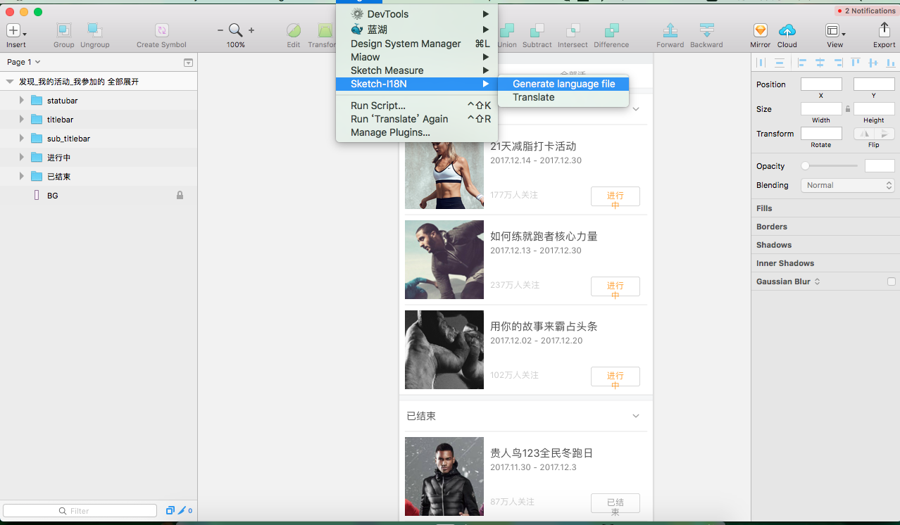
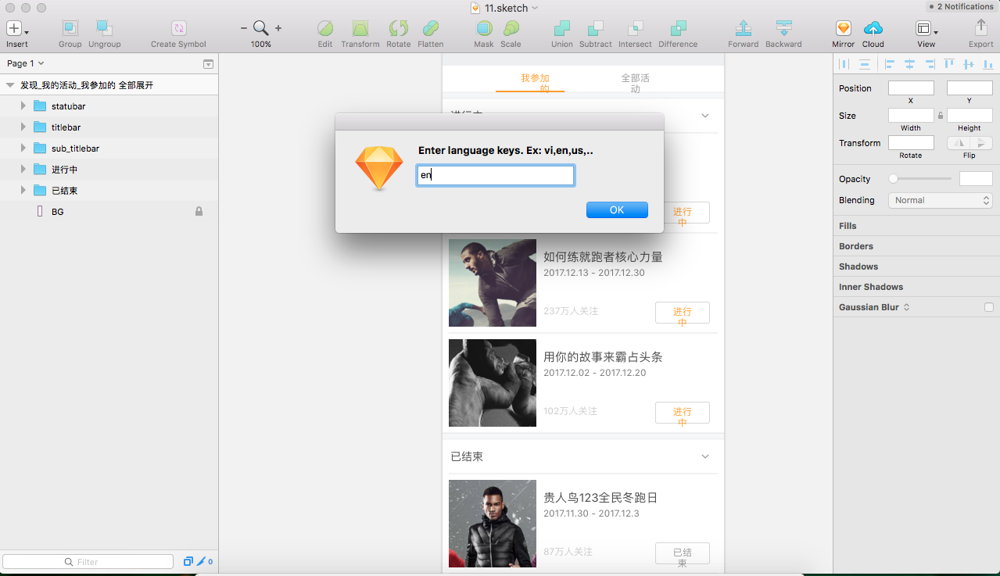
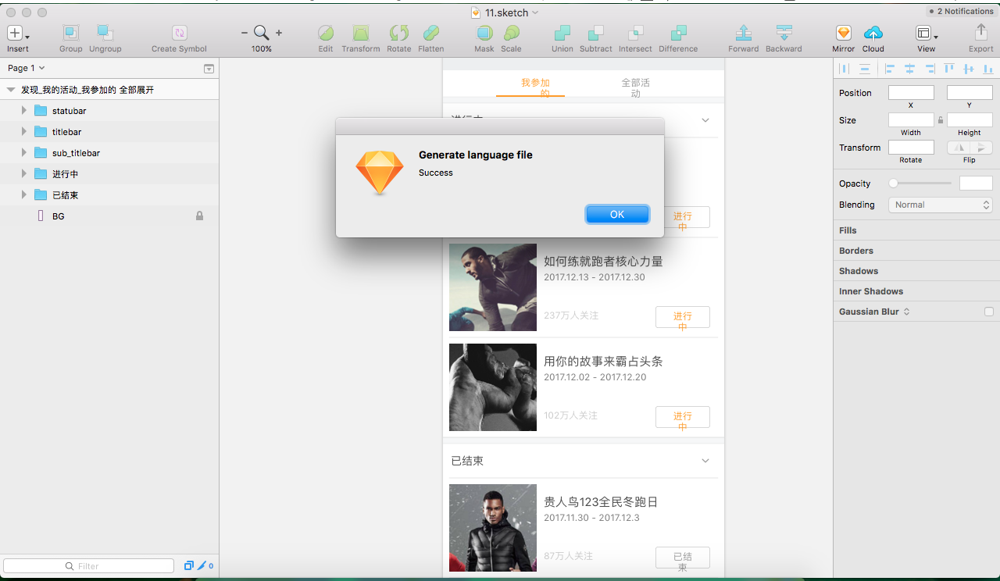
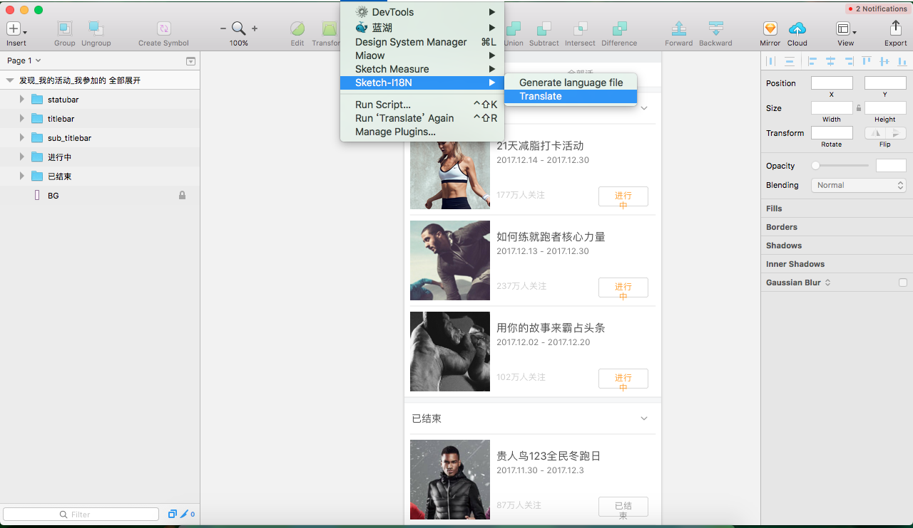
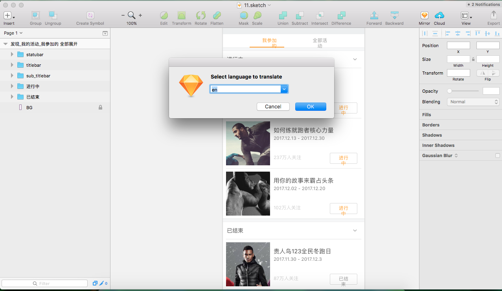
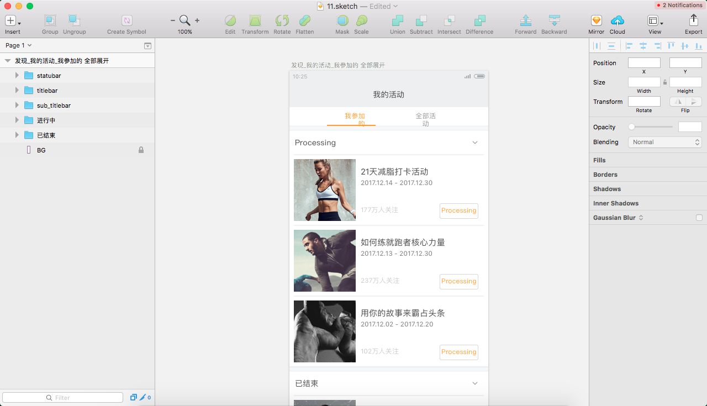

# Sketch-Plugin-i18n
Make real-time display of other languages in sektch file

## Manual Installation
1. [Download the ZIP file with the Sketch-Plugin-i18n](https://github.com/shiyafei/Sketch-Plugin-i18n) and unzip
2. Copy the Sketch-i18n.sketchplugin file to the Sketch plugin directory

## Introduction
- Start Generate

- Input one Language code

- Generate Success

- Translate

- Select Language

- Translate Success
